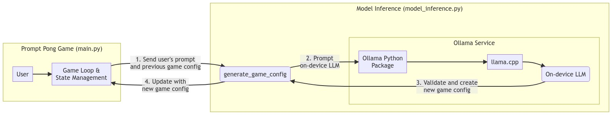
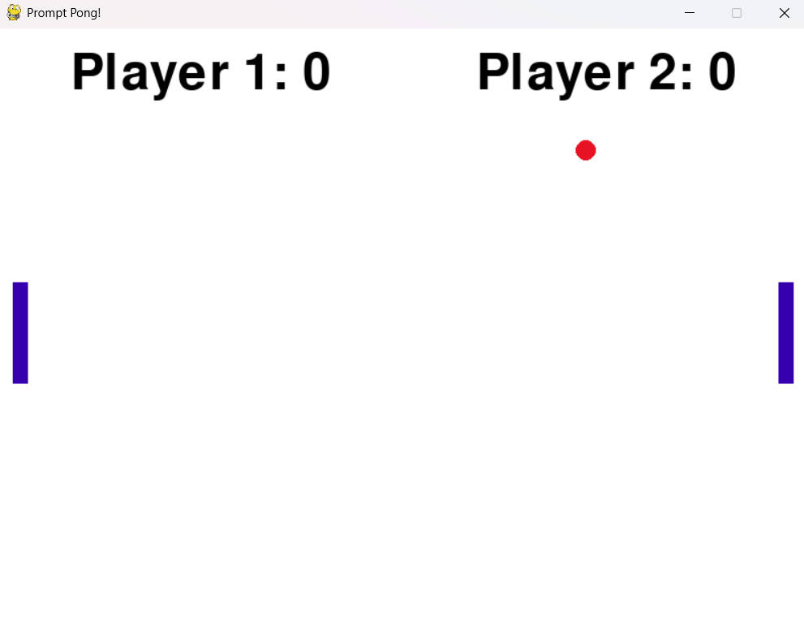
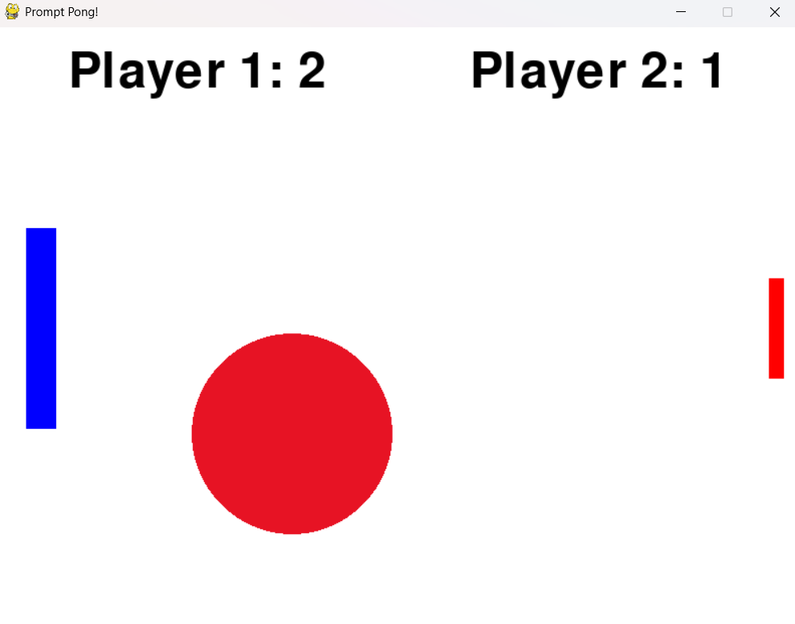

# 🕹️ Prompt Pong

This interactive two-player game of pong showcases the on-device inferencing capabilities of the Snapdragon X Elite platform and Ollama. Players compete and the round's winner can dynamically alter the game environment by prompting an on-device large language model (LLM). This real-time sample demonstrates how local AI processing can enable adaptive gameplay, personalized experiences, and low-latency decision-making all without relying on cloud connectivity.

## Requirements

### Hardware

1. A device with a Qualcomm [Snapdragon X Elite Processor](https://www.qualcomm.com/products/mobile/snapdragon/laptops-and-tablets/snapdragon-x-elite)
    - While other laptops are compatible, they may not deliver the same level of performance or responsiveness as those powered by the Snapdragon X Elite processor

### Software

1. [Python 3.13](https://www.python.org/)
2. [Ollama](https://ollama.com/)

## Installation Instructions

1. Clone this Github Repository directly on your Snapdragon X Elite device
    - Use a command such as `git clone https://github.com/qualcomm/snapdragon-compute-samples.git`
2. Install Ollama
    - Download and install Ollama [here](https://ollama.com/download)
3. Install the Qwen2.5 Coder on-device model with Ollama
    - Run the command `ollama pull qwen2.5-coder:3b`
4. Install the required Python packages
    - Run the command `pip install -r requirements.txt`
    - Make sure you are in the `src/pong` directory

## Usage

1. Make sure you have first followed the [Requirements](#requirements) and [Installation Instructions](#installation-instructions) steps above
2. Start the game of pong with the command: `python main.py`
    - Make sure you are in the `src/pong` directory
3. Controls:
    - Player 1 (left paddle): 'W' for up and 'S' for down
    - Player 2 (right paddle): 'Up Arrow' for up and 'Down Arrow' for down
4. After a point is scored, the winner of the round is asked to provide a prompt to change the game. An on-device LLM will re-generate the Pong game based on the prompt. After 5 points, the game will end!

## Technical Details

### Tech Stack Overview

Prompt Pong is completely designed in Python. The main Python packages used are:

- [pygame](https://www.pygame.org/docs/): a package for Python game development
- [ollama](https://github.com/ollama/ollama-python): a package that interfaces with on-device LLM models
- [pydantic](https://docs.pydantic.dev/latest/): a package integrated with ollama to provide better structured outputs from LLMs

The game is composed of three Python files:

- [main.py](./main.py): contains the main game loop and game logic
- [model_inference.py](./model_inference.py): contains the actual inferencing of the on-device models
- [game_config.py](./game_config.py): contains a class that configures the Pong game

### Model Inferencing

Between points being scored, the winner of that round is asked to provide a prompt to change the game. Once the player sends a prompt, the prompt and previous game configuration are sent to an Ollama model on a separate thread. Once the model returns the new game configuration and is validated, the game loop and game logic are re-rendered and the game continues until 5 points are scored.

#### System Prompt Methodology

When designing the prompt for the Ollama model, it was important to first understand the <a href="https://ollama.com/blog/structured-outputs" target="_blank">how structured outputs are implemented</a> on Ollama. A low temperature, set num_ctx, and higher repeat_penalty were used to ensure consistent and accurate results. To enure that the model properly returns the structured data needed, several additional checks were added.

## Screenshots

The base game before any prompts.

The game after a few rounds of prompts!

## License

This repository and project is licensed under the [BSD-3-clause License](https://spdx.org/licenses/BSD-3-Clause.html).
